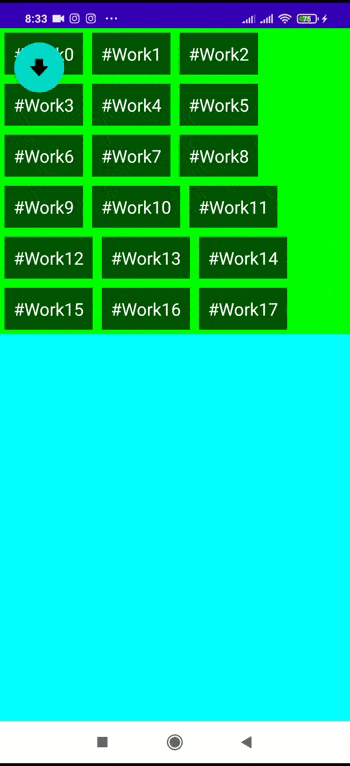

"HideMenu2" Shows how to create a hide menu in Android.

The app uses Layouts of the Relative type to have total control over the position and size of the elements.

This App uses the Layout.post () methods to obtain the information about the correct dimensions of the Menu only when the UI has it available.

Another improvement is the use of a custom Layout as the base for the menu ... which offers more flexibility in the layout.

The repository only contains the source files folder.

  

